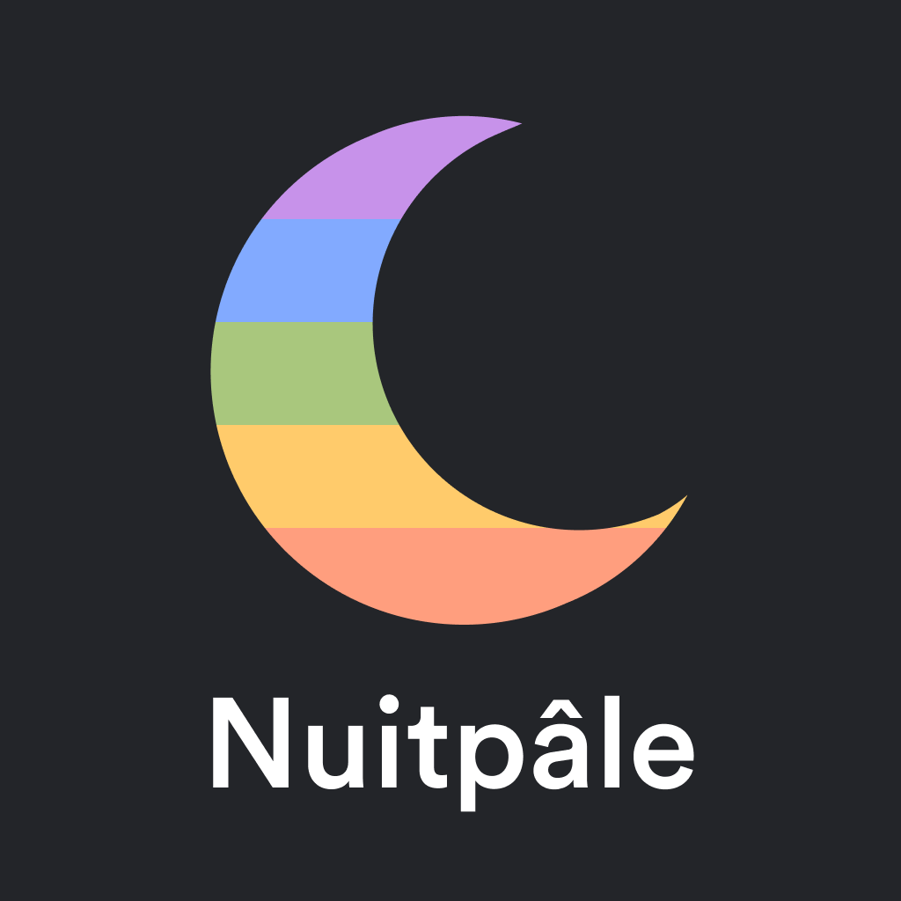
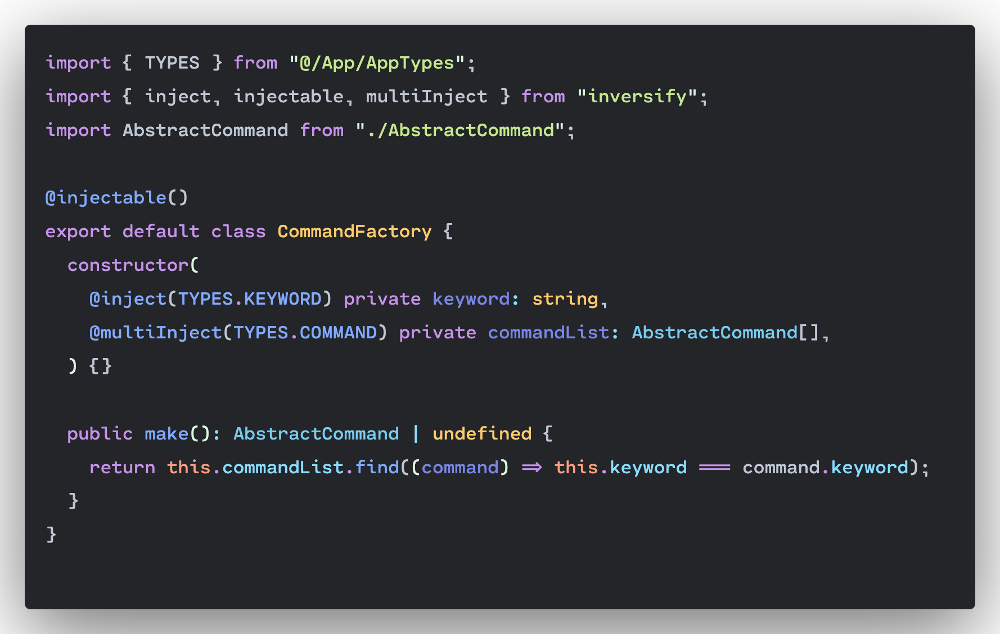

 
 

A darker version of the Palenight theme.

 

 

# Installation

1. Open the **Extensions** sidebar in VS Code. `View → Extensions`
2. Search for `Nuitpale`, choose **Nuitpâle Theme** by **Anqo**
3. Click **Install** to install it
4. Navigate to `File → Preferences → Color Theme → Nuitpâle Theme`

 

# Differences

 - Black editor background
 - Replace purplish elements with a white color
 - Orange this/booleans/nulls instead of red
